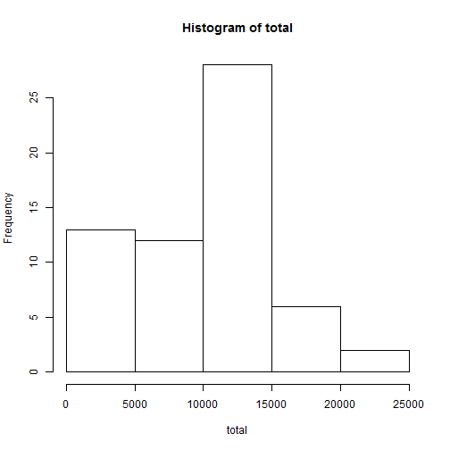
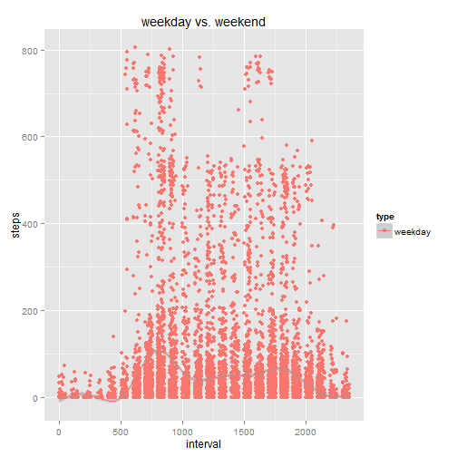
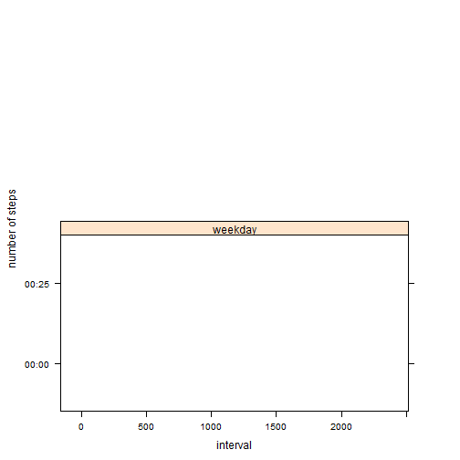

## Loading and preprocessing the data

```r
activity <- read.csv("activity.csv", header=TRUE, sep=",")
summary(activity)
```

```
##      steps                date          interval     
##  Min.   :  0.00   2012-10-01:  288   Min.   :   0.0  
##  1st Qu.:  0.00   2012-10-02:  288   1st Qu.: 588.8  
##  Median :  0.00   2012-10-03:  288   Median :1177.5  
##  Mean   : 37.38   2012-10-04:  288   Mean   :1177.5  
##  3rd Qu.: 12.00   2012-10-05:  288   3rd Qu.:1766.2  
##  Max.   :806.00   2012-10-06:  288   Max.   :2355.0  
##  NA's   :2304     (Other)   :15840
```

For each date, there are 288 observations, each of which is made by 5min interval around clock (1440min = 60min/hr*24hr)
 
At first, the max value of "interval" (2355) seems strange, since it is larger than 1440. How could it be if it represents minutes. So let's pull out the first a few lines of the "interval" vector:

```r
head(activity$interval, 25)
```

```
##  [1]   0   5  10  15  20  25  30  35  40  45  50  55 100 105 110 115 120
## [18] 125 130 135 140 145 150 155 200
```
#### It is worth noting the jump, in "interval" column, from 55 to 100, 155 to 200, and so on. Therefore, the integer in "interval" could be viewed as hhmm. For example, 55 represents 00:55, 2355 23:55. 


## What is mean total number of steps taken per day?

```r
total <- with(activity, tapply(steps, date, sum, na.rm=T))
hist(total)
```

 

```r
summary(total)
```

```
##    Min. 1st Qu.  Median    Mean 3rd Qu.    Max. 
##       0    6778   10400    9354   12810   21190
```
#### The median of total number of steps taken per day is 10400, and the mean 9354.


## What is the average daily activity pattern?

```r
average <- with(activity, tapply(steps, interval, mean, na.rm=T))
a <- data.frame(interval=as.integer(names(average)), steps=average)
library(ggplot2)
ggplot(aes(x=interval, y=steps, group=1), data=a) + geom_line()
```

 

#### The average daily actitivy pattern of the subject, indicated by the number of steps, could be inferred as the following: get up very early in the morning (around 6am, steps pick up), busiest hours in the morning (from around 8am to 10am, steps peak), relatively less busy  afternoon (small steps surges), gradually ease up in the evening (from around 8pm), finally rest around midnight (steps down to zero).

#### The interval that contains the maximum number of steps is 835, which represents the five minutes interval between 08:35 and 08:40 in the morning (the subject might be rushing to work!):

```r
which.max(average)
```

```
## 835 
## 104
```


## Imputing missing values
1. According to the summary of "activity" in the first part of the report, the number of NAs is 2304;
2. I decide to use the mean of that 5-min interval to fill in the missing value, for two reasons: 1) it is closer to whatever the actual value might be, compared to the mean of that day; 2) the mean of all intervals have already been calculated earlier and stored in an array called "average". Let's recall what is in array "average":

```r
head(average)
```

```
##         0         5        10        15        20        25 
## 1.7169811 0.3396226 0.1320755 0.1509434 0.0754717 2.0943396
```

The name of each mean value is its corresponding interval, which could be used as identifier when replacing NA with that interval mean:

```r
for (i in 1:nrow(activity)) {
      if (is.na(activity[i, 1])) {
            activity[i, 1] <- average[which(names(average) == activity[i, 3])]
            }
      }
```

3. Let's take a look at the new "activity" dataframe: 

```r
head(activity)
```

```
##       steps       date interval
## 1 1.7169811 2012-10-01        0
## 2 0.3396226 2012-10-01        5
## 3 0.1320755 2012-10-01       10
## 4 0.1509434 2012-10-01       15
## 5 0.0754717 2012-10-01       20
## 6 2.0943396 2012-10-01       25
```

4.

```r
total_new <- with(activity, tapply(steps, date, sum))
summary(total_new)
```

```
##    Min. 1st Qu.  Median    Mean 3rd Qu.    Max. 
##      41    9819   10770   10770   12810   21190
```
#### Both median and mean of the new total daily number of steps are 10770. After filling in the missing value, the estimate of total daily number of steps becomes HIGHER than before.


## Are there differences in activity patterns between weekdays and weekends?
1. Let's first create a new variable called "weekdays":

```r
activity$weekdays <- weekdays(as.Date(as.character(activity$date), format="%Y-%m-%d"), abbreviate=T)
```
And then let's create a new variable "type":

```r
activity$type <- "weekday" ## assign "weekday" to each type value
## if weekdays value equals to Sat. or Sun. (the characters are the corresponding Chinese), replace "weekday" with "weekend"
for (i in 1:nrow(activity)) {
      if (activity[i, 4] == "周六" | activity[i, 4] == "周日") {
            activity[i, 5] <- "weekend"
            }
}
activity$type <- as.factor(activity$type) ## convert "type" column into factor
```
Apply the simplest method to find out if there is any difference between weekday and weekend:

```r
qplot(interval, steps, data=activity, geom=c("point", "smooth"), color=type, main="weekday vs. weekend")
```

 

#### Yes, there are noticeable differences:  more steps in the weekday morning than in the weekend morning, and more steps in the weekend afternoon than in the weekday afternoon.

In order to produce the plot of required format:

```r
attach(activity)
ag <- aggregate(steps, by=list(interval, type), FUN = mean)
head(ag)
```

```
##   Group.1 Group.2         x
## 1       0 weekday 1.7169811
## 2       5 weekday 0.3396226
## 3      10 weekday 0.1320755
## 4      15 weekday 0.1509434
## 5      20 weekday 0.0754717
## 6      25 weekday 2.0943396
```

```r
library(lattice)
attach(ag)
```

```
## The following object is masked _by_ .GlobalEnv:
## 
##     x
```

```r
xyplot(x~Group.1|Group.2, type="l", xlab="interval", ylab="number of steps", 
       layout=c(1,2))
```

```
## Warning in diff(as.numeric(y[ord])): NAs introduced by coercion
```

```
## Warning in (function (x, y, type = "p", groups = NULL, pch = if
## (is.null(groups)) plot.symbol$pch else superpose.symbol$pch, : NAs
## introduced by coercion
```

 

it also corroborates my finding above.
